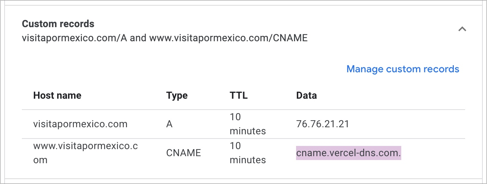

# Proyecto de pruebas con nextjs

Este proyecto se creo con la idea de investigar y probar una forma de hacer la re dirección a una url de la aplicación dependiendo el dominio.

Se configuraron 3 dominios apuntando a la aplicación desplegada en Vercel.

Redirect con con un middleware:

- [visitapormexico.com/visitapormexico/21312](visitapormexico.com/visitapormexico/21312)

Usando la configuración de redirects:

- [joobslot.com](joobslot.com)

Sin re dirección se muestra el sitio original

- [arthurolg.com](arthurolg.com)

## Documentación

- [Registrar dominios con vercel](docs/custom-domains.md)
- [Uso de `redirects` para definir rutas](docs/redirects.md)
- [Poner un middleware para aplicar la re dirección](docs/middleware.md)
