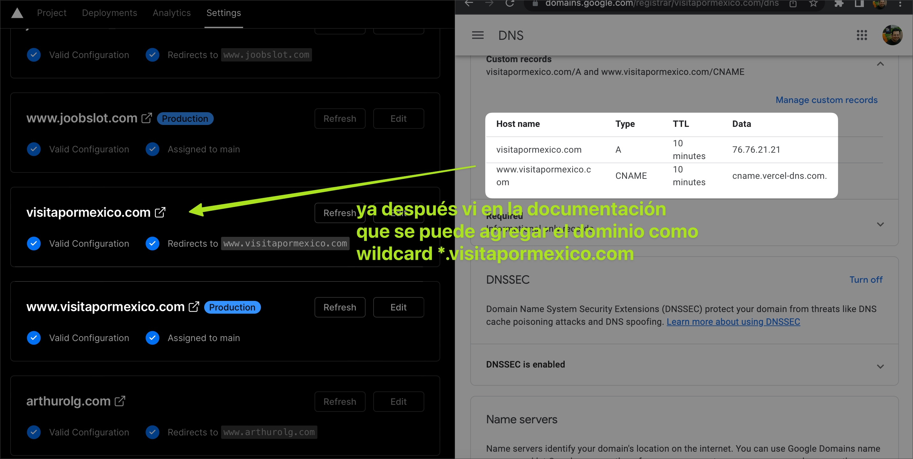

# Registrar dominios

> Vercel en las cuentas Hobby permite solo 50 registros de dominios, pero para las cuentas de Pro en adelante se pueden registrar dominios ilimitados.

Similar a Netlify se pueden vincular los dominios de los hoteles al proyecto de vercel, solo hay que entrar al proyecto y registrar los dominios necesarios.

El cliente tiene que cambiar dos registros en sus DNS:

- El `registro A`, debe estar apuntando a la IP `76.76.21.21`.
- El `registro CNAME www`, debe tener el valor `cname.vercel-dns.com.`

En caso de ser necesario en el proyecto de vercel, se puede registrar el dominio como un wildcard `*.hotel-domain.com`

Al momento de vincular el dominio, el sistema de vercel genera los certificados de seguridad necesarios para cada dominio.

## Enlaces de interés

- [Agregar un dominio personalizado en Vercel](https://vercel.com/guides/how-do-i-add-a-custom-domain-to-my-vercel-project)
- [Asignar un dominio al proyecto](https://vercel.com/docs/concepts/get-started/assign-domain)
- [Usando wildcard en un dominio](https://vercel.com/docs/concepts/projects/domains/add-a-domain#using-wildcard-domain)
